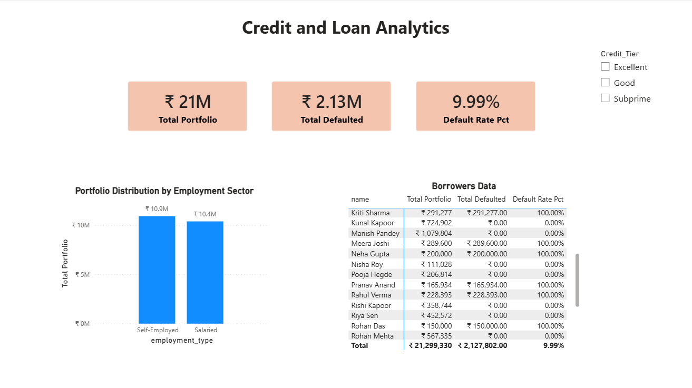

# Retail-Banking-Credit-Risk-Analytics
End-to-end BFSI analytics project using MySQL and Power BI to evaluate loan portfolio defaults.

# 📌 Executive Project Overview
This project delivers an end-to-end business intelligence solution for a retail banking portfolio. By engineering an institutional relational database structure, executing advanced diagnostic SQL queries, and building an interactive Power BI analytics layer, this ecosystem exposes critical concentrations of bad debt. It transforms unorganized customer application logs into dynamic, decision-ready data for credit risk underwriting and portfolio stabilization teams.

# 🛠 Tech Stack & Architecture
- Database Engine: MySQL Workbench
- Analytics & Business Intelligence: Power BI Desktop
- Data Modeling Paradigm: Star Schema (1:Many Relationship via borrower_id)
- Advanced Logic Modules: SQL Window Functions, CTEs, Conditional Aggregations, and DAX Statistical Expressions

# 💾 Phase 1: Database Engineering & Advanced Analytics
The relational data infrastructure consists of two distinct entities (borrowers as the dimension table, and loans as the transactional fact table) connected via primary/foreign key pairs.
1. Diagnostic Analysis: Structural Risk Exposures

   To isolate critical defaults and map regional/demographic portfolio risks, complex SQL pipelines were built to target specific corporate parameters.

   Conditional Portfolio Aggregation (Loss Concentrations)

   - Business Goal: Pinpoint exactly which employment categories present the highest financial liability to the bank.
   - SQL Strategy: Utilized custom conditional aggregates (SUM nested inside CASE WHEN) to cleanly separate toxic debt from healthy capital, scaling the division mathematically to prevent integer truncation errors.
  
     SELECT 
    b.employment_type,
    SUM(CASE WHEN l.loan_status = 'Defaulted' THEN l.loan_amount ELSE 0 END) AS Total_Defaulted_Loan,
    ROUND(
        (SUM(CASE WHEN l.loan_status = 'Defaulted' THEN l.loan_amount ELSE 0 END) * 100.0) 
        / SUM(l.loan_amount), 
        2) AS Percentage_Overall_Loan
    FROM borrowers b
    JOIN loans l ON b.borrower_id = l.borrower_id
    GROUP BY b.employment_type;

2. Advanced Intrasector Performance Ranking

   - Business Goal: Rank individual borrowers based on historical payment delinquency directly inside their specific job classification without collapsing transactional row integrity.
   - SQL Strategy: Implemented DENSE_RANK() over partition structures to dynamically compile operational collection targets.

     SELECT
    b.name,
    b.annual_income,
    b.employment_type,
    l.missed_payments,
    DENSE_RANK() OVER (
        PARTITION BY b.employment_type 
        ORDER BY l.missed_payments DESC
    ) AS drank
    FROM borrowers b
    JOIN loans l ON b.borrower_id = l.borrower_id;

# 📊 Phase 2: Power BI Dashboard & DAX Semantic Layer

The clean relational datasets were extracted via MySQL Workbench and integrated into Power BI Desktop under a single cross-filtering architecture.

1. Robust DAX Semantic Formulas
   To eliminate data calculation drops when filtering across safe borrower tiers, resilient logical conditions were injected into the data measures:

   - Total Portfolio Footprint: Total Portfolio = SUM(loans[loan_amount])
   - Toxic Asset Volume: Total Defaulted = CALCULATE(SUM(loans[loan_amount]), loans[loan_status] = "Defaulted") + 0
   - Gross Delinquency Index: Default Rate Pct = DIVIDE([Total Defaulted], [Total Portfolio], 0)
     
2. Dashboard UI Layout Architecture

   - Executive KPI Cards: Left-to-right macro-level performance blocks detailing Total Active Credit, Realized Capital Loss, and the Overall Portfolio Failure Rate.
   - Categorical Analytics Layer: A structural clustered column chart evaluating capital distribution footprints across market segments.
   - Operational Drill-Down Matrix: A complete customer log matching macro-KPI components to granular name rows for direct collection tracking.

# 💡 Key Business Insights & Strategic Impact

- Concentrated Portfolio Vulnerability: While the bank's overall global default rate presents a highly manageable footprint of 9.99%, extracting the safe categories exposes a highly volatile 72.25% default rate strictly concentrated within the Subprime tier.
- Sector-Specific Volatility Risk: The Self-Employed segment is approximately 6x riskier than the Salaried professional market, accounting for ₹1,851,330 in defaults (a 16.96% failure rate) vs. a minor 2.66% failure rate for Salaried applicants.
- Data-Driven Credit Policy Redirection: Armed with these insights, the credit risk team can confidently automate approvals for Excellent and Good tiers, implement mandatory manual underwriting reviews for incoming Self-Employed applications, and halt unsecured debt exposure within subprime credit classes.
